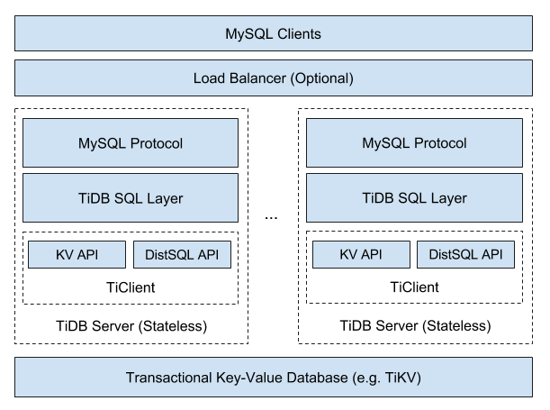
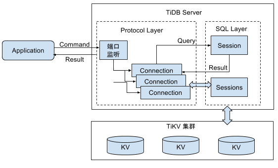
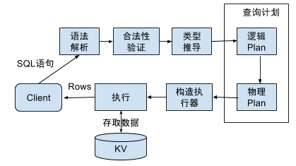
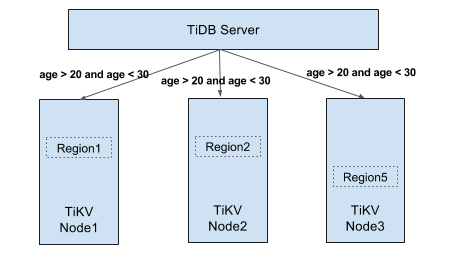

本文档面向 TiDB 社区开发者，主要介绍 TiDB 的系统架构、代码结构以及执行流程。  目的是使得开发者阅读文档后，可以对 TiDB 项目有一个整体的了解，更好的参与进来。首先会介绍一下大体的结构以及 Golang 包的结构，然后会介绍内部的执行流程，最后会对优化器、执行器这两个最重要的组件做一些说明。

## 目录
+ [系统架构](#系统架构)
+ [代码结构概述](#代码结构概述)
+ [协议层](#协议层)
+ [SQL 层](#sql-层)
+ [优化器](#优化器)
+ [执行器](#执行器)
+ [分布式执行器](#分布式执行器)

# 系统架构



TiDB Server 在整个系统中位于 Load Balancer(或者是 Application) 与底层的存储引擎之间，主要部分分为三层：
+ MySQL Protocol 层

接收 MySQL Client 的请求，解析 MySQL Protocol 的包并转换为 TiDB Session 中的各种命令；处理完成后，将结果结果为 MySQL Protocol 格式，返回给 Client。
+ SQL 层

解析并执行 SQL 语句，制定查询计划并优化，生成执行器并通过 KV 层读取或写入数据，最后返回结果给 MySQL Protocol层。这一层是重点，后面会详细介绍。
+ KV 层

提供带事务的（分布式/单机）存储，在 KV 层和 SQL 层之间，有一层抽象，使得 SQL 层能够忽略下面不同的 KV 存储的差异，看到统一的接口。 

# 代码结构概述

这里首先会把所有的 package 列出来，然后介绍其主要功能。这一章会比较散，信息量比较大，可以结合下一章节一起理解。
+ tidb

    这个包可以认为是 MySQL Protocol Layer 和 SQL Layer 之间的接口，主要的文件有三个：
    - session.go: 每一个 session 对象对应一个 MySQL Client 的 connection，MySQL Protocol 层负责管理 connection 与 Session 之间的绑定关系，并且各种 MySQL 查询/命令都是调用 Session 的接口来执行。
    - tidb.go:一些函数，供 session.go 调用
    - bootstrap.go: 当 TiDB Server 启动后，如果发现系统未经初始化，会执行初始化流程，详细信息会在下面的章节中介绍。

+ docs

    一些简略的文档，更详细的文档参见[中文文档](https://github.com/pingcap/docs-cn)以及[英文文档](https://github.com/pingcap/docs)。 

+ executor

    TiDB 执行器，SQL 语句最终会转化为一系列执行器（物理算子）的组合。这个包对外暴露的最主要的接口是 Executor:
    ```
    type Executor interface {
    // 返回下一行数据（如果返回为空，则表明没有更多数据）
    Next() (*Row, error) 
    // 关闭当前执行器，做一些清理工作
    Close() error
    // 改执行器返回结果的 Schema，包括每个 Field 的详细信息
    Schema() expression.Schema
    }
    ```
    各种执行器都会实现这个接口，TiDB 的执行引擎采用 Volcano 模型，执行器之间通过上述三个接口交互，每一个执行器只需要通过 Next 接口从其他执行器获取数据以及通过 Schema 接口获取数据的元信息。

+ plan

    这里是整个 SQL 层的核心，SQL 语句解析成 AST 之后，在这个包中制定出查询计划，并对查询计划进行优化，包括逻辑优化和物理优化。
    这个包中还包括下面几个功能：
    - validator.go：对 AST 进行合法性验证
    - preprocess.go： 目前只有 name resolve 这一项
    resolver.go：名称解析，将 SQL 语句中的标识符（database/table/column/alias）解析并绑定到对应的 column 或者是 Field 上。
    typeinferer.go：推导结果类型。对于 SQL 语句，不需要执行即可推导出结果的类型。
    logical_plan_builder.go: 制定出优化的逻辑查询计划
    physical_plan_builder.go: 根据逻辑查询计划制定出物理查询计划

+ privilege

    权限控制相关接口，具体实现在 privilege/privileges 包中

+ sessionctx

    存放 session 中的状态信息，比如 session variable 信息，这些信息可以在 session 中获取，放在单独的包中主要是理清依赖关系，避免循环依赖问题。 

+ table

    table接口，对数据库中的表做了一层抽象，提供很多对表的操作（如获取表的 column 信息、读取一行数据等），具体实现在 table/tables 中。另外这里还有对于 Column 以及 Index 的抽象。

+ tidb-server

    tidb-server 程序的 main.go，主要是启动为 server 的代码。

+ server

     MySQL Procotol 层的实现，主要工作是解析协议、传递命令/Query。

+ ast

    sql 文本会被解析为一棵抽象语法树，ast 中定义了树的数据结构，每个节点都需要实现 visitor 接口，然后调用树中节点的的 Accept 方法，对树进行遍历。
    如果需要添加新的语法支持，那么除了在 parser 中增加规则之外，还需要在这个包中添加数据结构。

+ ddl

    异步 Schema 变更相关代码，类似 Google F1 的论文实现。[算法详解](https://github.com/ngaut/builddatabase/blob/master/f1/schema-change.md)。

+ domain

    domain 可以认为是一个存储空间，可以在其中创建数据库、创建表，不同的 domain 之间，可以存在相同名称的数据库，有点像 Name Space。domain 上会绑定 information schema 信息。

+ expression

    表达式的定义，最重要的接口是 :
    ```go
    type Expression interface {
    .....
    }
    ```
    目前实现这个接口的表达式包括：
    ```
    Scalar Function：标量函数表达式

    Aggregate Function：聚合函数表达式

    Column：列表达式

    Const：常量表达式
    ```

+ evaluator

    表达式求值相关逻辑，所有的表达式求值方法都在这里。

+ infoschema

    InformationSchema 的实现，提供 db/table/column 相关信息。

+ kv

    KV 相关的接口定义和部分实现，包括 Retriever / Mutator / Transaction / Snapshot / Storage / Iterator 等。对下层的多种KV存储做了一个统一的抽象。

+ model

    TiDB 支持的 ddl / dml 相关的数据结构，包括 DBInfo / TableInfo / ColumnInfo / IndexInfo 等

+ parser

    语法解析模块，主要包括词法解析 (lexer.go) 和语法解析 (parser.y)，这个包对外的主要接口是 Parse()，用于将 SQL 文本解析成 AST。

+ store

    底层 KV 存储的实现，如果要接入新的存储引擎，可以将其进行包装，代码放在这个包下面，目前接入两个引擎：分布式引擎（tikv）和单机引擎（localstore/{goleveldb/boltdb}）。这里的新引擎需要实现 kv 包中定义的接口。
关于kv和store，可以参考 [TiDB 存储引擎接入指南](https://github.com/ngaut/builddatabase/blob/master/tidb/storage.md)

+ terror

    定义了 TiDB 的 error 体系，另外使用方法参见[详细规范](https://docs.google.com/a/pingcap.com/document/d/1L7th17VTZCOeb4RfFqgs9cya6yORKqWcjB2fYqckOFU/edit?usp=sharing)

+ context

    context接口，session 是 context 接口的一个实现，这里抽象出接口来，主要是避免循环依赖。session 各种各种状态信息都通过这个接口存取。

+ inspectkv

    TiDB SQL Data 和 KV 辅助 check 包，以后会用于外部对于 TiDB KV 的访问，将被重新定义和扩展

+ meta

    TiDB 的 meta 数据相关常量定义以及常用函数定义。meta/autoid 定义了一个用于生成全局唯一session内自增 ID 的API，meta 信息依赖于这个工具。

+ mysql

    MySQL 相关的常量定义。

+ structure

    在 key-value上做了一层封装，支持更丰富的支持 Transaction 的 KV 类型，包括 string / list / hash 等。主要在异步 Schema 变更中使用。

+ util

    一些工具类，这里有一个包比较重要，就是 types 包，里面有很多和类型的定义以及对各种类型对象的操作。

+ distsql

    分布式 SQL 执行接口，如果下层的存储引擎支持分布式执行器，可以通过这个接口发送请求，后面会详细介绍这个模块。

# 协议层

协议层是和应用交互的接口，目前 TiDB 只支持 MySQL 协议，相关的代码都在 server 包中。

这一层的主要功能是管理客户端 connection，解析 MySQL 命令并返回执行结果。这一层是按照 MySQL 协议实现，具体的协议可以参考：[https://dev.mysql.com/doc/internals/en/client-server-protocol.html](https://dev.mysql.com/doc/internals/en/client-server-protocol.html)

单个 connection 处理命令的入口方法是 clientConn 类的 [dispatch 方法](https://github.com/pingcap/tidb/blob/master/server/conn.go#L350)，这里会解析协议并调用不同的处理函数。



# SQL 层

经过上面章节，读者已经了解了 TiDB 整体框架以及各个包的细节，本章开始讲解核心章节，对 TiDB 的 SQL 层如何 work 做一个简要的介绍。这里忽略具体的 KV 层，只关注 SQL 层。希望通过本章，读者可以了解一条 SQL 语句是如何从一段文本变成执行结果集。整个流程中的详细过程会在接下来的几个章节中说明。

大体上讲，一条 SQL 语句需要经过，语法解析-->合法性验证-->制定查询计划-->优化查询计划-->根据计划生成查询器-->执行并返回结果 等一系列流程。TiDB 的执行流程以这个为基础，流程图如下：



整个流程的入口在 tidb 包的 session.go 中，TiDB-Server 调用 Session.Execute() 接口，输入为文本格式的 SQL 语句，实现在 session.Execute()。

首先会调用 Compile() 对 SQL 语句进行语法解析（tidb.Parse()），解析后会得到一个 stmt 的列表，这里每条语句都是一个 AST（抽象语法树），每一个语法单元都是数的一个 Node，结构定义都在 ast 包中。

得到 AST 之后，调用 executor 包中的 Compiler，输入 AST，得到执行器（Compiler.Compile()）。在这个过程中，会完成合法性验证、制定计划以及优化查询计划。

进入 Compiler.Compile() 函数，首先会调用 plan.Validate() 对语句进行合法性验证（见 plan/validator.go），然后进入 Preprocess 流程，目前这个阶段，Preprocess 只做了名称解析工作，及将 SQL 语句中的提到的 column 名或者  alias name 绑定到对应的 field上。比如”select c from t;”这个语句，会将 c 这个名字绑定到 t 这个表的对应列上（具体的实现见 plan/resolver.go）。之后就进入 optimizer.Optimize()。

Optimize() 方法中，首先对 AST 中各个node的结果进行推导，如 "select 1, ’xx‘, c from t;”，对于 select fields，第一个 field是”1“，其类型为 Longlong，第二个 field 是”’xx‘“, 其类型为 VarString，第三个field是 “c” 其类型为表 t 中 column c 的类型。注意这里除了类别之外还有 charset 等信息，都要进行推导，具体实现见 plan/typeinferer.go。完成类型推导后，进行逻辑优化（planBuilderbuild()），主要工作是根据代数运算，对 AST 进行等价变换，化简 AST。比如 ”select c from t where c > 1+1*2;“ 可以等价变换为”select c from t where c > 3;“。

逻辑优化完成后，进行物理优化，生成查询计划树，并利用索引、根据一些 rule 以及 cost 模型，对树进行变换，减少查询过程的代价，入口在 plan/optimizer.go 中的 doOptimize()方法。

生成查询计划后，会转换为执行器，通过 Exec 接口执行得到 RecordSet对象，对其调用 Next() 方法获取查询结果。

# 优化器

优化器是数据库的核心，决定了每条语句如何执行。如果说数据库是一支军队，那么优化器就是这支军队的主将、军师，需要运筹帷幄，决胜于千里之外。俗话说一将无能累死三军，同样的一条语句，选择不同的查询计划，最终的运行时间可能会相差很大。对优化器的研究一直是学术界比较活跃的领域，优化是永无止境，可以说在这块投入多大的精力都不为过。
从优化方法上，大致可以分为三类：
+ Rule based optimizer：通过启发式规则对 plan 进行优化

+ Cost based optimizer：通过计算查询代价对 plan 进行优化

+ History based optimizer：通过历史查询信息对 plan 进行优化

基于规则的优化器比较容易实现，只要选取一些常用的规则，就可以对大多数常用的查询有较好的效果。但是其缺陷也比较明显：无法根据数据的真实情况，选择最优的方案。比如对于查询语句 “select * from t where c1 = 10 and c2 > 100” 在选择索引时，如果只根据规则，那么一定是选择 c1 上面的索引进行查询，但是如果 t 中 c1 所有的值都是 10，那么这个查询计划就很差。这个时候如果有表中数据分布的信息，对选择好的查询计划很有帮助。

基于代价的优化器复杂一些，其核心问题有两个，一个是如何获取数据的真实分布信息，另一个是如何根据这些信息，估算出某一个查询计划所需的代价。

基于历史信息的查询优化器用的比较少，一般 OLTP 数据库中不会涉及。

TiDB 的优化器相关代码在 plan 包中，这个包的主要工作是将 AST 转换为查询计划树，树中的节点是各种逻辑算子或者是物理算子，对查询计划化的各种优化都是通过调用树根节点的各种方法，递归地对所有节点进行优化，并且会不断的对树中的节点进行转换和裁剪。
最重要的几个接口在 plan.go 中，包括：
+ Plan： 所有查询计划的接口 
+ LogicalPlan：逻辑查询计划，所有的逻辑算子都需要实现这个接口
+ PhysicalPlan：物理查询计划，所有的物理算子都需要实现这个接口

逻辑优化的入口是 planbuilder.build()，输入是 AST，输出是逻辑查询计划树。然后在这棵树上进行逻辑查询优化：
+ 调用 LogicalPlan 的 PredicatePushDown 接口，将谓词尽可能下推
+ 调用  LogicalPlan 的 PruneColumns 接口，将不需要的列裁减掉
+ 调用 aggPushDownSolver.aggPushDown，将聚合算子下推到 Join 之前

拿到逻辑优化后的查询计划树之后，会进行物理优化，代码的入口是对逻辑查询计划树的根节点调用 convert2PhysicalPlan(&requiredProperty{})，其中 requiredProperty 是对下层返回结果顺序、行数的要求。
逻辑查询计划树从根节点开始，不断的递归调用，将每个节点从逻辑算子转成物理算子，并且根据每个节点的查询代价找到一条比较好的查询路径。

# 执行器

虽然优化器是最核心的组件，但是缺少优秀的执行器，依旧无法构成一个优秀的数据库。同样以军队为例，执行器就是军队中冲锋陷阵的士兵。再厉害的将军，如果没有一群能征善战的士兵，同样无法打胜仗。

相比 MySQL，TiDB 的执行器有两个有点，第一是整个计算框架是一个 MPP 的框架，计算会在多台 TiKV 以及 TiDB 节点上进行，尽可能提高效率和速度；第二是单个算子会尽可能并行，比如 Join/Union 等算子，会启动多个线程同时计算，整个数据计算流程构成一个 pipeline，尽可能缩短每个算子的等待时间。所以 TiDB 在处理大量数据时，比 MySQL 表现好。

执行器最重要的接口在 executor.go 中:
```go
// Executor executes a query.
type Executor interface {
    Next() (*Row, error)
    Close() error
    Schema() expression.Schema
}
```
通过优化器得到的物理查询计划树会转换为一个执行器树，树中的每个节点都会实现这个接口，执行器之间通过 Next 接口传递数据。比如 “select c1 from t where c2 > 10; ” 最终生成的执行器是 Projection->Filter->TableScan 这三个执行器，最上层的 Projection 会不断的调用下层执器的 Next 接口，最终调到底层的 TableScan，从表中获取数据。

# 分布式执行器

TiDB 作为分布式数据库，内置一个分布式的计算框架，Query 在执行的时候，会尽量分布式+并行。这个框架的入口在 distsql 包中，最重要的是下面两个接口：


DistSQL 提供的对外最重要的一个接口是 Select()。第一个参数 kv.Client，只要 KV 引擎满足带事务、满足 KV 接口，并且满足这个 Client 的一些接口，就可以接入 TiDB。目前有一些其他的厂商和 TiDB 合作开发，在其他的 KV 上 run TiDB，并且支持分布式的 SQL。第二个参数是 SelectRequest 。这个东西是由上层执行器构造出来的，它把计算上的逻辑，比如说一些表达式要不要排序、要不要做聚合，所有的信息都放在 req 里边，是一个 Protobuf 结构，然后发给 Select 接口，最终会发送到进行计算的 TiKV region server 上。



分布式执行器在 TiDB 端的主要工作是做任务的分发和结果的收集。Select 接口返回一个数据结构，叫 SelectResult ，这个结构可以认为是一个迭代器，因为下层是有很多 region server，每个节点返回的结果是一个 PartialResult。在这些部分结果之上封装了一个 SelectResult ，就是一个 PartialResult  的迭代器。通过这个的 next 方法可以拿到下一个  PartialResult 。
SelectResult 的内部实现可以认为是个 pipeline。TiDB 会并发地向各个 region server 发请求，并且按照预定的顺序返回结果给上层，这里的顺序是由下层结果返回顺序以及 Select 接口的 KeepOrder 参数共同决定。

这部分相关的代码可以参看 distsql 包以及 store/tikv/coprocessor.go。